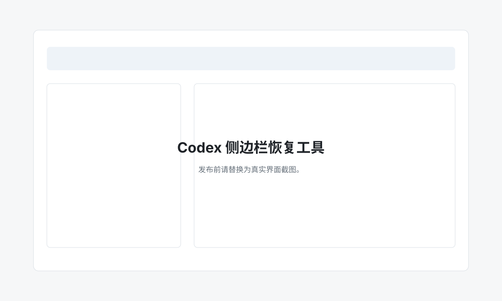

# Codex 侧边栏恢复工具

一个面向中文用户的本地工具，用来把 Codex Desktop 里“还在本机历史记录中、但没有出现在左侧栏”的项目和会话恢复回来。

支持两种用法：下载双击版 App，或者用一条 `npx` 命令启动。界面中勾选项目或会话，先预览，再备份并恢复。



## 双击版下载

从 GitHub Release 下载最新版本：

- `.zip`：解压后直接双击 `.app`，这是第一版推荐分发格式
- `.dmg`：可选安装包格式，可用 `npm run app:dist:dmg` 单独构建

第一版 macOS App 暂未签名、未 notarize。如果系统提示“无法打开”或“来自身份不明的开发者”，可以：

1. 在 Finder 里右键 App，选择“打开”。
2. 或到“系统设置 → 隐私与安全性”里允许打开。

Electron 双击版不要求用户安装 Node.js；但 v1 仍依赖系统里可用的 `sqlite3` 命令行工具。

## 命令行快速开始

```bash
npx codex-sidebar-recovery
```

从本仓库本地运行：

```bash
npm start
```

工具会在 `127.0.0.1` 启动本地服务，自动打开浏览器，并扫描你的 `~/.codex` 状态文件。所有数据只在本机读取，不会上传。

## 命令参数

```bash
codex-sidebar-recovery [--codex-home <path>] [--port <number>] [--no-open]
```

- `--codex-home <path>`：指定 Codex 数据目录，默认是 `~/.codex`
- `--port <number>`：指定本地端口，默认 `8765`
- `--no-open`：只启动服务，不自动打开浏览器

## 它会读取什么

工具会读取 Codex Desktop 的本地状态：

- `~/.codex/state_5.sqlite`
- `~/.codex/.codex-global-state.json`
- `~/.codex/session_index.jsonl`
- 数据库中引用的会话 rollout JSONL 文件

它会把你选择的会话同步到当前 Codex Desktop 前端实际读取的侧边栏状态：

- `sidebar-project-thread-orders`
- `sidebar-chat-thread-order`
- `pinned-thread-ids`
- `pinned-project-ids`
- `thread-workspace-root-hints`
- workspace roots 和 persisted sidebar atoms

默认只恢复主会话：`archived = 0`、`has_user_event = 1`、`source = 'vscode'`。

已归档会话会在界面中展示，但默认不会恢复；如果你明确勾选“恢复已归档”，工具会先取消归档再恢复。子代理会话只作为参考展示，不会塞进主侧边栏。

## 安全策略

- “预览”是只读操作，不改任何文件。
- “执行恢复”前一定会创建备份。
- 本地服务只监听 `127.0.0.1`。
- 每次启动都会生成随机 token，浏览器 URL 中携带该 token。
- 不上传数据，不请求外部服务，不收集日志。

备份目录：

```text
~/.codex/repair_backups/sidebar-recovery-YYYYMMDDHHMMSS/
```

每次备份包含：

- `state_5.before.sqlite`
- `codex-global-state.before.json`
- 如果存在则包含 `session_index.before.jsonl`
- 被选中会话对应的 rollout JSONL 文件
- `restore-report.json`

## 系统要求

- macOS + Codex Desktop
- Node.js 18+
- 命令行中可以使用 `sqlite3`

v1 版本优先支持 macOS。代码里尽量不写死用户名和绝对路径，后续可以扩展到 Windows/Linux，但当前正式支持目标是 macOS Codex Desktop。

## 常见问题

### 为什么有些旧会话看不到？

先试试搜索项目路径、标题或会话 ID，并勾选“显示已归档”。子代理会话会显示为“子代理”，但不会恢复到主侧边栏。

### 为什么执行恢复前要退出 Codex？

Codex 运行时可能把侧边栏状态保存在内存里。如果一边运行一边写文件，Codex 退出时可能把修复结果覆盖掉。先退出再写入，结果更稳定。

### Provider 迁移是什么意思？

如果你换过 API key 或 provider，旧会话记录可能还指向以前的 provider。勾选“迁移 Provider”后，工具会把选中会话的 provider 更新成 `~/.codex/config.toml` 中当前的 provider。

### 怎么撤回一次恢复？

打开报告里的备份目录。里面有恢复前的 SQLite 数据库、全局状态、session index 和选中会话 rollout 文件。

## 开发

```bash
npm run check
npm pack --dry-run
node ./bin/codex-sidebar-recovery.js --no-open
npm run app:dev
npm run app:pack
npm run app:dist
npm run app:dist:dmg
```

项目刻意使用 Node 内置模块和原生浏览器 JavaScript，不引入 React/Vite。Electron 只作为双击版桌面外壳，核心恢复逻辑仍在本地服务中。

## 开源发布

首次发布到 GitHub、打 tag、上传 Release、发布 npm 的步骤见：

[docs/RELEASE.md](docs/RELEASE.md)

## License

MIT
